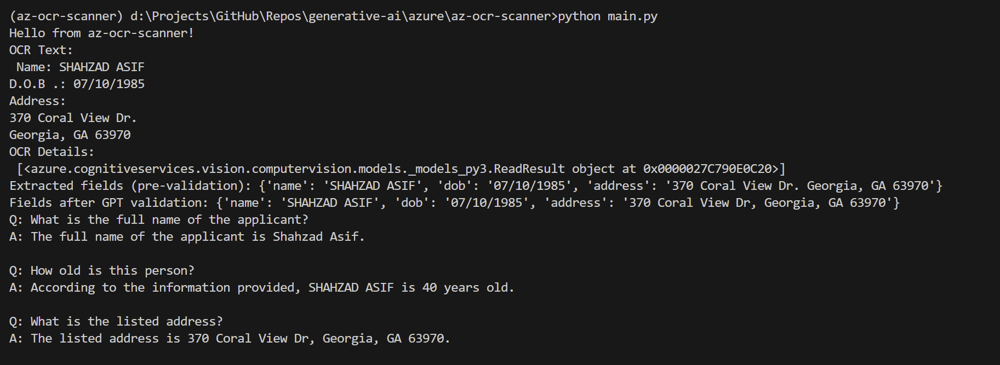
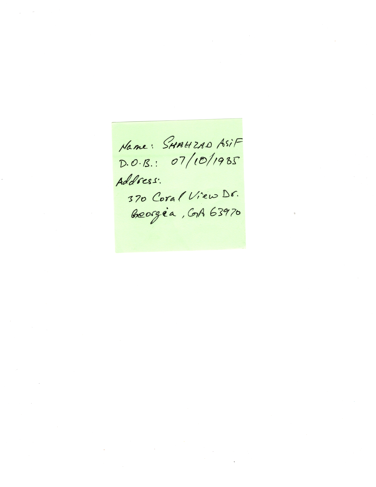

# az-ocr-scanner
AI-based OCR Scanner using Azure Cognitive Services (Computer Vision) and Azure OpenAI (GPT-4)

## Summary
This application uses Azure Cognitive Services and Azure OpenAI resources to process hand-written documents (PNG, JPEG) and extract the matching fields (name, date of birth, address). The original document is processed using Optic Character Recognition (OCR) through the Azure Computer Vision resource. As hand-written documents may not be legible (read-able), the OCR'ed response is further processed through the Azure OpenAI (GPT-4) to extract any possible data that matches these expected fields (above).
Next, the Azure OpenAI (GPT-4) is used to answer the required questions based on the extracted fields.

This repository includes the complete deployment of Azure resources using Terraform.  This allows quick and uniform deployment of the required resources. Before using this, you must include the Azure Subscription Id in **variables.tf**.

## Running the application in VS Code - Local
To execute this application in the local environment, we use **uv** for python virtual environment.

1. Ensure to log into Azure CLI.
```code
az login
```

2. Initialize the UV and create a virtual environment.

Initialize UV:
```code
uv init
```
Create the virtual environment:
```code
uv venv
```
Activate the virtual environment:
```code
.venv\Scripts\activate
```
Install all the Python dependencies:
```code
uv pip install -r requirements.txt
```

3. Deploy the Azure resources using Terraform Hashicorp Configuration Language (HCL) scripts (.tf). Within the **Infrastructure** folder, run the following commands.

Initialize Terraform:
```code
terraform init
```
Create a new execution plan before actually creating the resource. This validates the Terraform scripts against any logical errors.  The plan is saved as *az-ocr-scanner-plan*.
```code
terraform plan -out=az-ocr-scanner-plan
```
Execute this plan to deploy the resources in Azure.  This creates the necessary resources under **az-ocr-scanner-rg" resource group in the selected subscription.
```code
terraform apply az-ocr-scanner-plan
```

4. After successful deployment, Terraform outputs provide the endpoints and keys that must be saved into the **.env** file for the application.  The following Powershell (.ps1) script updates the **.env** file in the root folder, using these outputs.
```code
powershell .\post-apply.ps1
```

5. Next, we can run/debug the application using VS Code.  To launch the application, use the following code:
```code
python main.py
```
It loads the JPEG file from **data** folder and provides the following output:


**Original document**
